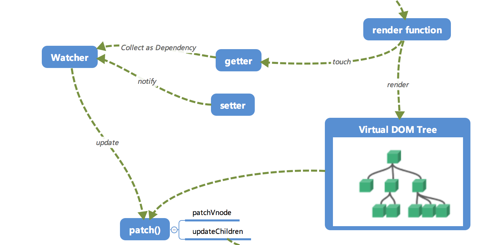

#### Vue的响应系统机制
vue数据双向绑定，即MVVM的实现。
> Vue双向数据绑定的核心和基础api是Object.defineProperty,其内部真正参与数据双向绑定流程的主要有Observer、Dep和Watcher,基于defineProperty和发布者订阅者模式，最终实现数据的双向绑定。
 
 1、依靠于Object.defineProperty()来实现监测一个普通对象的变化。（数据劫持）（demo详见js文件）
 2、通过Dep 和 watcher实现数据依赖
 > 为什么要使用依赖收集?
 ```
 new Vue({
    data(){
        return {
             name:'zane',
             sex:'男'
        }
    }
})

 ```
 > 有上面这个data，实际上页面只使用到了name，并没有使用age，根据Object.defineProperty的转换，如果我们设置了this.sex='女'，那么Vue也会去执行一遍虚拟DOM的比较，这样就无形的浪费了一些性能，因此才需要做依赖收集，界面用到了就收集，没有用到就不收集。
 > * 只收集需要用到的属性
 * Dep模块的位置在src/core/observer/dep.js，主要作用是收集订阅者的容器。
 * 每个属性都有自己的Dep对象，而使用get方法将当前的watcher对象（Dep.target）放在Dep对象中。

* 由此可见，「依赖收集」的前提条件：（1）触发 get 方法(通过渲染视图)；（2）新建一个 Watcher 对象？？？？什么时候创建的。
> 实现依赖收集的方式：这个我们在 Vue 的构造类中处理。新建一个 Watcher 对象只需要 new 出来，这时候 Dep.target 已经指向了这个 new 出来的 Watcher 对象来。而触发 get 方法也很简单，实际上只要把 render function 进行渲染，那么其中的依赖的对象都会被「读取」，这里我们通过打印来模拟这个过程，读取 test 来触发 get 进行「依赖收集」。



？？？？为什么使用depend，而不使用addSub


* 关于watcher什么时候创建的可以去到整个生命周期去探索。
调用了mountComponent函数时，这个函数做了三件事，调用beforeMount钩子函数，生成Watcher对象，接着调用mounted钩子函数。数据双绑、AST对象处理完后，这里的Watcher对象负责将两者联系到一起：