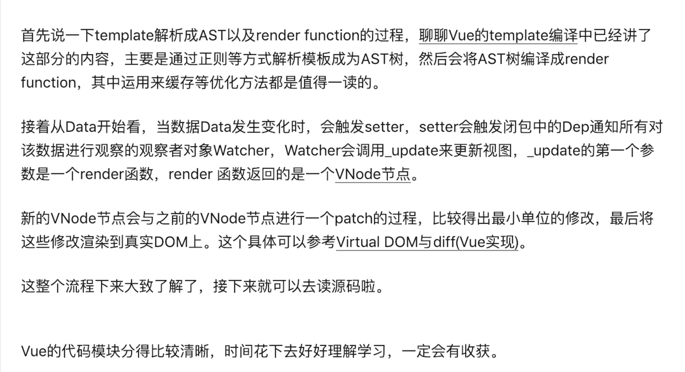

* 读源码之前，你需要掌握一些基本原理，这样可以让你更快地理解源码。可以先从响应式原理入手，读懂响应式的原理。
[关于Vue.js](https://github.com/answershuto/learnVue/blob/master/docs/%E5%93%8D%E5%BA%94%E5%BC%8F%E5%8E%9F%E7%90%86.MarkDown)
* 然后学习依赖收集，明白Vue对数据双向绑定的整个过程。
[为什么要依赖收集](https://github.com/answershuto/learnVue/blob/master/docs/%E4%BE%9D%E8%B5%96%E6%94%B6%E9%9B%86.MarkDown)

* 基本流程

[参考书籍](https://github.com/answershuto/learnVue)
[聊聊Vue的template编译](https://github.com/answershuto/learnVue/blob/master/docs/%E8%81%8A%E8%81%8AVue%E7%9A%84template%E7%BC%96%E8%AF%91.MarkDown)
[VNode节点](https://github.com/answershuto/learnVue/blob/master/docs/VNode%E8%8A%82%E7%82%B9.MarkDown)
[Virtual DOM与diff(Vue实现)](https://github.com/answershuto/learnVue/blob/master/docs/VirtualDOM%E4%B8%8Ediff(Vue%E5%AE%9E%E7%8E%B0).MarkDown)