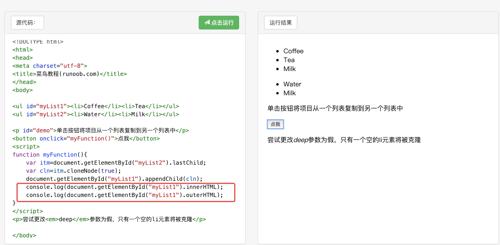
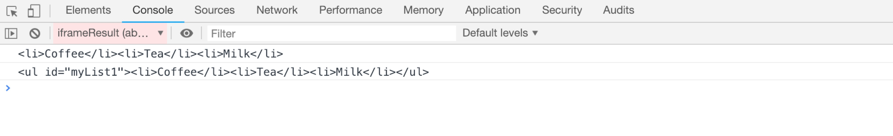

### vue实例挂载的实现

vue的实例挂载主要借助的是$mount的函数去挂载的vm，下面我们来分析一下src/platform/web/entry-runtime-with-compile.js下的源码
```
/* @flow */

import config from 'core/config'
import { warn, cached } from 'core/util/index'
import { mark, measure } from 'core/util/perf'

import Vue from './runtime/index'
import { query } from './util/index'
import { compileToFunctions } from './compiler/index'
import { shouldDecodeNewlines, shouldDecodeNewlinesForHref } from './util/compat'

const idToTemplate = cached(id => {
  const el = query(id)
  return el && el.innerHTML
})
/*把原本不带编译的$mount方法保存下来，在最后会调用。*/
const mount = Vue.prototype.$mount
/*挂载组件，带模板编译*/
Vue.prototype.$mount = function (
  el?: string | Element,
  hydrating?: boolean
): Component {
  el = el && query(el)

  /* istanbul ignore if */
  if (el === document.body || el === document.documentElement) {
    process.env.NODE_ENV !== 'production' && warn(
      `Do not mount Vue to <html> or <body> - mount to normal elements instead.`
    )
    return this
  }

  const options = this.$options
  // resolve template/el and convert to render function
   /*处理模板templete，编译成render函数，render不存在的时候才会编译template，否则优先使用render*/
  if (!options.render) {
    let template = options.template
     /*template存在的时候取template，不存在的时候取el的outerHTML*/
    if (template) {
         /*当template是字符串的时候*/
      if (typeof template === 'string') {
        if (template.charAt(0) === '#') {
          template = idToTemplate(template)
          /* istanbul ignore if */
          if (process.env.NODE_ENV !== 'production' && !template) {
            warn(
              `Template element not found or is empty: ${options.template}`,
              this
            )
          }
        }
      } else if (template.nodeType) {
        /*当template为DOM节点的时候*/
        template = template.innerHTML
      } else {
        /*报错*/
        if (process.env.NODE_ENV !== 'production') {
          warn('invalid template option:' + template, this)
        }
        return this
      }
    } else if (el) {
       /*获取element的outerHTML*/
      template = getOuterHTML(el)
    }
    if (template) {
      /* istanbul ignore if */
      if (process.env.NODE_ENV !== 'production' && config.performance && mark) {
        mark('compile')
      }

      const { render, staticRenderFns } = compileToFunctions(template, {
        shouldDecodeNewlines,
        shouldDecodeNewlinesForHref,
        delimiters: options.delimiters,
        comments: options.comments
      }, this)
      /* 如果render函数不存在（render函数存在会优先使用render）会将template进行compileToFunctions得到render以及staticRenderFns。*/
       /*将template编译成render函数，这里会有render以及staticRenderFns两个返回，这是vue的编译时优化，static静态不需要在VNode更新时进行patch，优化性能*/
      options.render = render
      options.staticRenderFns = staticRenderFns

      /* istanbul ignore if */
      if (process.env.NODE_ENV !== 'production' && config.performance && mark) {
        mark('compile end')
        measure(`vue ${this._name} compile`, 'compile', 'compile end')
      }
    }
  }
  return mount.call(this, el, hydrating)
}

/**
 * Get outerHTML of elements, taking care
 * of SVG elements in IE as well.
 */
// 目的是返回el序列化的HTML片段（见图片）
function getOuterHTML (el: Element): string {
  if (el.outerHTML) {
    return el.outerHTML
  } else {
    // ****要注意这里deep复制的是节点不是整个块元素
    const container = document.createElement('div')
    container.appendChild(el.cloneNode(true))
    // 此时。el挂载在div下面的，所以使用innerHTML就可以返回原始的el的序列化片段
    return container.innerHTML
  }
}

Vue.compile = compileToFunctions

export default Vue
````
1、[outerHTML & innerHTML之间的区别](https://developer.mozilla.org/zh-CN/docs/Web/API/Element/outerHTML)


2、[cloneNode](http://www.runoob.com/jsref/met-node-clonenode.html)
参数|类型|描述
--|:--:|--:
deep|Boolean|可选。该方法将复制并返回调用它的节点的副本。如果传递给它的参数是 true，它还将递归复制当前节点的所有子孙节点。否则，它只复制当前节点。

> 应当要注意的是，clone它复制的是节点，而不是该元素下的整个模块。所以在参数是false的情况下，这个[例子](http://www.runoob.com/try/try.php?filename=tryjsref_node_clonenode)才会出现只复制了一个空的li的情况。

3、$mountd的过程：
