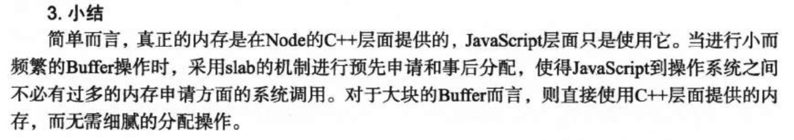

### 理解Buffer

#### Buffer结构
* Buffer像一个array结构，主要用于操作字节。
* Buffer所占用的内存不是在V8的堆内存中分配的，是堆外内存。在C++层面实现的内存申请，js中分配内存的策略？？？？？
* node启动时就已经加载了Buffer，所以它是一个全局对象。

1、 Buffer对象
* Buffer类似于数组，它的元素为十六进制的两位数，即0-255的数值。（xx形式,对于十六进制的换算自行百度。）
> 十六进制（简写为hex或下标16）在数学中是一种逢16进1的进位制。一般用数字0到9和字母A到F（或a~f）表示，其中:A~F表示10~15，这些称作十六进制数字。

* 不同编码的字符串占用的元素的个数各不相同。

* 可以通过length属性得到长度，也可以通过下角标访问属性。

* 给属性分别赋值小数、大于255和小于255的数的处理结果（见书）

2、Buffer内存分配
* Buffer所占用的内存不是在V8的堆内存中分配的，是堆外内存。实行的是在C++层面实现的内存申请，js中分配内存的策略。采用的是slab的分配策略（slab是一块申请好的固定大小的内存区域。其中有三种状态：full、partial、empty）？？？？？。

* Buffer是以8KB来区分是大对象还是小对象。8KB是每个slab的大小，在js层面上，也是以它最为单位单元进行内存的分配。
> 1、分配小的Buffer对象
当指定的Buffer对象小于8KB时，node会按照小对象进行分配。该过程中会使用一个局部变量pool作为中间处理对象，处于分配状态的slab都指向它。（也就是说8KB内存分配完了就不再指向pool了，pool是正在进行分配的slab）当创建一个Buffer时，node会判断当前的slab是否还有充足的空间进行存储，如果没有就新建一个slab。否则就使用当前的slab，并更新slab的状态。因此一个slab上面可能存在多个Buffer对象。（详见书本）
> 2、分配大的Buffer对象
直接分配一个SlowBuffer对象作为slab单元。SlowBuffer对象是在C++上面进行定义的，而我们一直说的Buffer对象是在JavaScript层面上，所以能够被V8垃圾回收标记回收。
> 3、


#### Buffer的转换
1、与字符串的转换
Buffer对象可以和字符串进行互相转换。
* 字符串转Buffer类型
通过构造函数完成 new Buffer(str, [encoding])，默认是按照UTF-8转码和存储。
Buffer对象可以存储不同编码类型的字符串转码的值（通过起始位置与编码类型）。但是要注意的是每种编码所用的字节长度不同。
* Buffer转换为字符串
使用toString()就可以实现。
2、使用Buffer.isEncoding(encoding)对该encoding进行判断，看node是否支持该编码转换。

#### Buffer拼接问题（常见问题）（见书）
1、宽字节的中文在UTF-8下每个文字占用三字节。所以会引起出现乱码的情况。
2、一般讲buffer转换为字符串进行输出。
3、setEncoding() 和 string_decoder()
4、正确拼接Buffer对象

```
let arr = [];
let size = 0;
//使用数组来存储接收到的Buffer片段并记录下总长度。
res.on('data', function(chunk) {
        arr.push(chunk); 
        // str += chunk;
        size = arr.length;
    });

res.on('end', function() {
    // 生成一个合并的Buffer对象，因为arr数组中存储的Buffer是一段一段的，所以要合并。
    let buf = Buffer.concat(arr, size);
});
```

#### Buffer与性能

* 在网络传输中，都需要转换为Buffer，已进行二进制数据传输。
> 针对静态文件，可以预先将静态内容转换成Buffer对象，在不需要改变内容的场景下，尽量读取Buffer文件，减少转换，提高性能。
* 文件读取
影响性能的两个：
（1）buffer与字符串转换时有性能损耗
（2）highWaterMark设置对性能有影响。